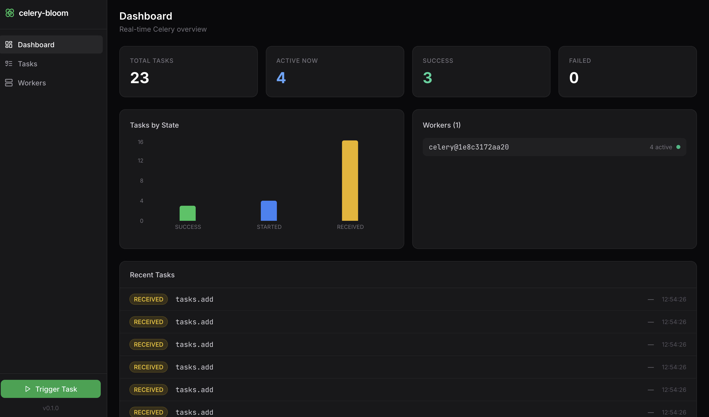
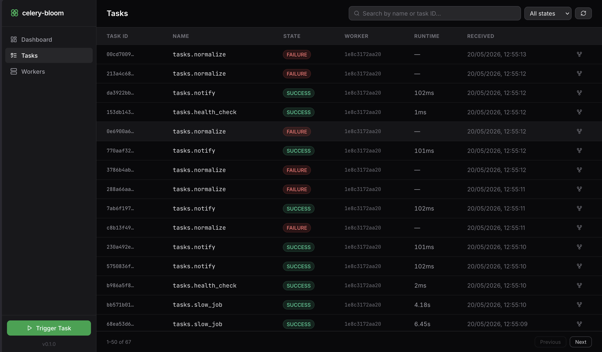
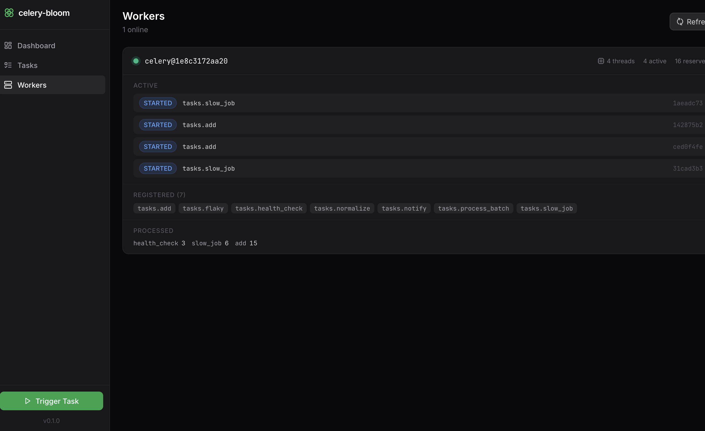
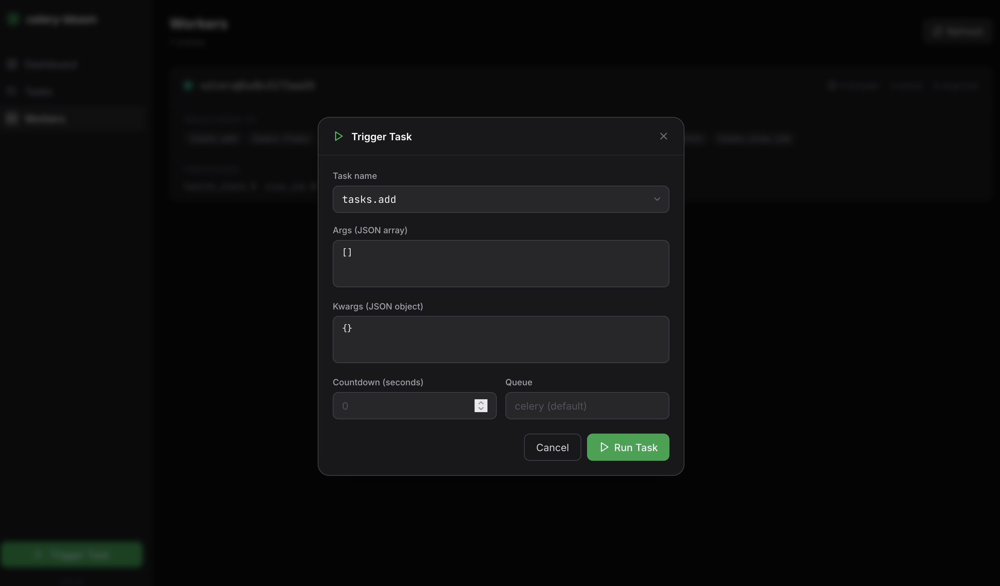

# celery-bloom

[](https://github.com/ashhadahsan/celery-bloom/actions/workflows/ci.yml)
[](https://codecov.io/gh/ashhadahsan/celery-bloom)
[](https://pypi.org/project/celery-bloom/)
[](https://pypi.org/project/celery-bloom/)
[](https://pypi.org/project/celery-bloom/)
[](LICENSE)

A modern, real-time monitoring UI for [Celery](https://docs.celeryq.dev/) — a drop-in replacement for Celery Flower with a clean dark UI, WebSocket-powered live updates, and rich task inspection.



## Features

- Real-time task stream via WebSocket (no page refresh needed)
- Task search and filtering by state
- Rich task detail drawer — args, kwargs, result, traceback
- Worker view with active, reserved, and registered tasks
- Revoke / terminate running tasks from the UI
- Trigger any registered task from the UI with custom args/kwargs
- Execution trace view — visualise chains and groups as a live DAG
- Single `uv tool install` — no Node.js required at runtime

## Screenshots

### Tasks



### Workers



### Trigger Task



## Quick start

```bash
uv tool install celery-bloom
celery-bloom --broker redis://localhost:6379/0
```

Open [http://localhost:5556](http://localhost:5556).

## Options

```text
celery-bloom --help

  --broker          Celery broker URL        (default: redis://localhost:6379/0)
  --result-backend  Result backend URL       (optional)
  --host            Bind host                (default: 0.0.0.0)
  --port            Port                     (default: 5556)
  --log-level       Log level                (default: info)
```

## Try it with Docker

Spin up Redis, a Celery worker, beat scheduler, and celery-bloom in one command:

```bash
# Build the frontend first (one-time)
make ui-install && make ui-build

# Start everything
docker compose up

# In another terminal, send some example tasks
docker compose exec worker uv run python example/seed.py --count 30
```

Open [http://localhost:5556](http://localhost:5556) and watch tasks flow in live.

The example app (`example/tasks.py`) includes:

- `tasks.add` — quick arithmetic, random delay
- `tasks.slow_job` — long-running task with progress updates
- `tasks.flaky` — randomly fails and retries
- `tasks.process_batch` — batch processing
- `tasks.health_check` — runs every 30s via beat

## Development

```bash
# Install Python deps
uv sync

# Install and run frontend dev server (hot reload on :5173, proxies API to :5556)
make ui-install
make ui-dev

# In another terminal
uv run celery-bloom --broker redis://localhost:6379/0

# Production build — bundles frontend into celery_bloom/static/
make ui-build

# Lint + type check
make lint
```

## Tech stack

| Layer    | Tech                                      |
|----------|-------------------------------------------|
| Backend  | FastAPI + uvicorn + Celery events         |
| Frontend | React 18 + TypeScript + Vite              |
| Styling  | Tailwind CSS                              |
| Charts   | Recharts                                  |
| Graph    | React Flow (@xyflow/react) + dagre        |
| Data     | TanStack Query + WebSocket                |

## License

MIT
